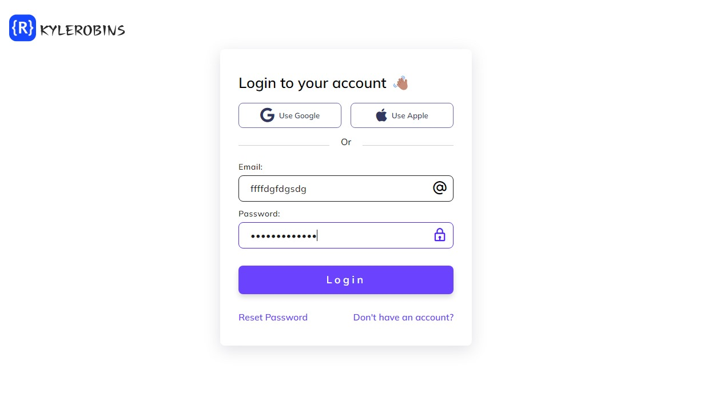

# Login UI Design

This project showcases a simple and stylish login UI design. The code includes an HTML file for the structure and a corresponding CSS file for styling.

## HTML Structure (index.html)

The HTML file defines the basic structure of the login page. It includes:

- Meta tags for character set and viewport settings.
- External CSS and font libraries for styling.
- An image logo in the header.
- Social login buttons for Google and Apple.
- A form with email and password input fields.
- Stylish divider lines and additional links.

## CSS Styling (style.css)

The CSS file provides styling for the HTML structure. Key styling elements include:

- A clean and modern overall layout.
- Custom styles for the logo, container, and form elements.
- Stylish social login buttons with hover effects.
- Custom input fields with icons and focus effects.
- Responsive design for various screen sizes.
- Color schemes that are visually appealing.

## Fonts

The project uses the Mulish font from Google Fonts to enhance the overall typography of the UI.

## How to Use

To use this login UI design in your project:

1. Download the HTML (index.html) and CSS (style.css) files.
2. Make sure to include the necessary external libraries for icons and fonts.
3. Customize the content and styling as needed for your specific requirements.

Feel free to explore and modify the code to suit your project's branding and design preferences.

## Credits

- Font Awesome for social media icons.
- Boxicons for additional icons.
- Mulish font from Google Fonts.

## License

This project is licensed under the [MIT License](LICENSE).
